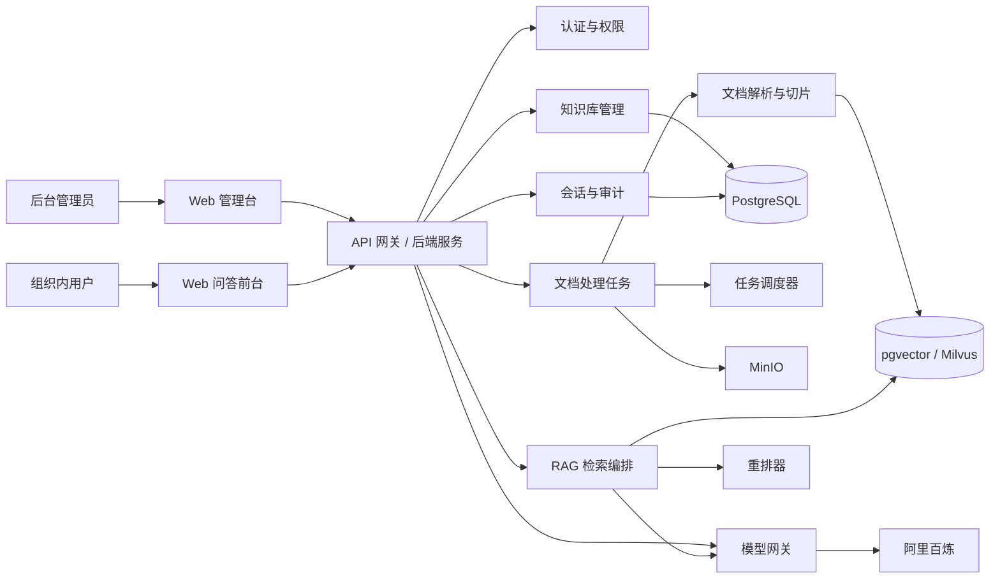
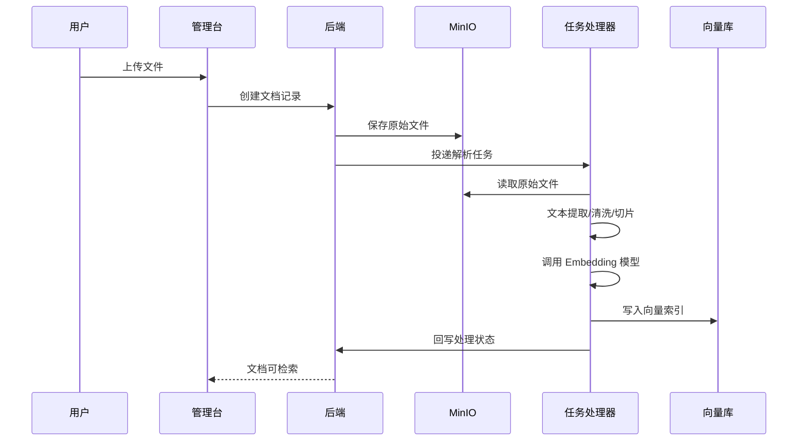
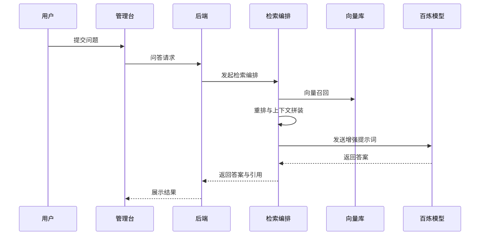
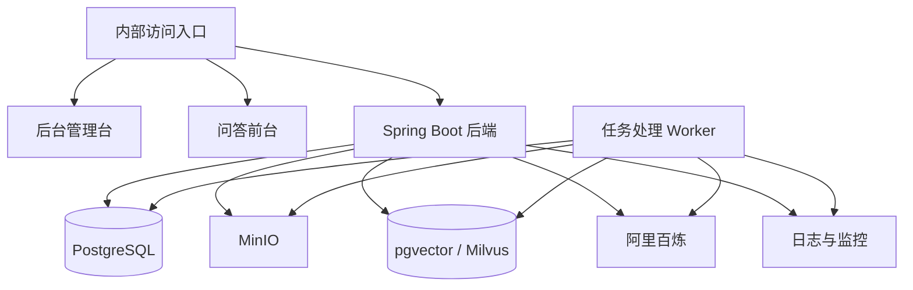

# RAG 知识库管理系统架构设计 V1

## 目录

- [1. 目标与范围](#1-目标与范围)
- [2. 技术选型结论](#2-技术选型结论)
- [3. 总体架构](#3-总体架构)
- [4. 核心模块划分](#4-核心模块划分)
- [5. 关键业务流程](#5-关键业务流程)
- [6. 部署架构建议](#6-部署架构建议)
- [7. 首期数据库设计](#7-首期数据库设计)
- [8. 首期迭代范围](#8-首期迭代范围)
- [9. 实施建议](#9-实施建议)

## 1. 目标与范围

本系统定位为公司内部使用的 RAG 知识库管理平台，服务于多业务部门的文档知识沉淀、检索增强问答、多模型调用和多模态内容处理场景。

首期范围建议覆盖以下能力：

- 知识库管理：知识库、文档、分段、索引、重建任务管理
- 模型管理：统一接入阿里百炼平台，支持多个模型配置和按场景选择
- RAG 问答：检索、重排、上下文拼装、问答记录
- 多模态能力：文生文、文生图、图生文、图生图的统一接入
- 文件存储：基于 MinIO 管理原始文件、解析结果和派生文件
- 后台治理：账号权限、操作审计、任务监控、配置中心

不建议在首期同时追求“所有高级 Agent 能力”。首期重点应是把知识导入、索引构建、检索问答、模型切换和后台可观测性做扎实。

## 2. 技术选型结论

### 2.1 推荐结论

建议采用以下组合：

- 后端：`JDK 21 + Spring Boot 3`
- AI 接入：`Spring AI Alibaba` 作为阿里百炼接入基础，但外层必须封装自定义模型适配层
- 前端管理台：`TypeScript + Vue 3`
- 前端问答端：`TypeScript + Vue 3`
- 关系型数据库：`PostgreSQL 16`
- Redis：首期即接入，承担会话控制、热点缓存、限流、防重复提交、任务去重与分布式锁能力
- 向量检索：
  - 首期优先 `pgvector`
  - 文档规模和检索复杂度上来后，再评估 `Milvus`
- 对象存储：`MinIO`
- 日志：`SLF4J + Logback`
- 基础可观测性：首期即具备结构化日志、健康检查、关键任务链路可追踪能力
- 数据库迁移：`Flyway`
- 定时任务：
  - 如果当前形态是单体项目，优先使用 `Spring Boot @Scheduled`
  - 只有在需要持久化调度、失败补偿、集群协调、错过补触发、任务管理后台时，再升级到 `Quartz` 或 `XXL-JOB`

### 2.2 为什么不建议直接全量 Node.js

Node.js/TypeScript 适合快速做 MVP，但本项目目标已经明显超出“轻量 API 聚合层”范畴，后期会迅速演化为企业内部平台。系统长期重点在于：

- 模型能力统一接入和动态配置
- 文档导入、切片、向量化、索引重建
- 异步任务、失败重试、运行监控
- 权限、审计、配置治理
- 多业务线可扩展性

这类平台型后台长期更适合由 Java/Spring 承担核心域模型和治理能力。

### 2.3 关键架构原则

- 业务层不能直接依赖具体模型 SDK
- Spring AI Alibaba 只能位于模型适配层，不能渗透到业务核心
- RAG 检索链路必须独立成编排层，避免散落在 Controller 和 Service 中
- 文档处理必须异步化，避免上传即同步解析
- 向量库和 Embedding 模型必须可替换

## 3. 总体架构



### 3.1 逻辑分层

建议按以下四层组织系统，而不是按“Controller-Service-DAO”简单堆叠：

1. 接入层
   负责 Web API、鉴权、参数校验、统一响应、限流审计。
2. 领域层
   负责知识库、文档、模型配置、会话、任务等核心业务逻辑。
3. 能力编排层
   负责 RAG 检索链路、模型调用链路、多模态任务编排。
4. 基础设施层
   负责 PostgreSQL、MinIO、向量库、百炼平台、日志、消息和任务框架接入。

### 3.2 核心设计思想

系统真正的核心不应是某个框架，而应是下面四个中台能力：

- `Model Gateway`：统一模型注册、能力描述、参数模板、路由和限额
- `Knowledge Pipeline`：文件上传、解析、切片、Embedding、入向量库、版本管理
- `Retrieval Orchestrator`：查询改写、召回、过滤、重排、上下文拼装、回答生成
- `Admin Governance`：权限、审计、任务、配置、监控

### 3.3 终端与接口分域

当前系统需要同时支撑后台治理端和组织内问答端，因此后端接口应显式分域：

- `/api/admin/*`：后台管理端
- `/api/app/*`：前台问答端
- `/api/internal/*`：内部回调与内部调用

同时会话与记忆链路应增加终端隔离维度，避免同一用户在后台和前台之间共享会话上下文。

建议最小隔离维度：

- `terminal_type`：`ADMIN` / `APP`
- `scene_type`：`GENERAL` / `KNOWLEDGE_BASE`
- `session_id`：同一终端、同一场景下的独立会话主键

## 4. 核心模块划分

### 4.1 模型网关模块

职责：

- 接入阿里百炼平台的多种模型能力
- 支持按模型类型配置不同参数模板
- 屏蔽具体模型 SDK 差异
- 统一输出标准响应结构

建议抽象：

- `ModelProvider`：模型提供方，例如 DashScope / 百炼
- `ModelDefinition`：具体模型定义，例如通义千问文本模型、Embedding 模型、图像模型
- `ModelCapability`：能力类型，例如 `TEXT_GENERATION`、`EMBEDDING`、`TEXT_TO_IMAGE`
- `ModelRoutePolicy`：模型路由策略，例如默认模型、按知识库指定、按租户指定

模型配置边界约定：

- 配置文件只保存平台接入级配置，例如百炼 `api-key`、网关地址、超时时间，以及系统级兜底默认模型
- 配置文件中的默认模型仅用于系统初始化、健康检查、兜底路由，不作为知识库运行时的主要模型选择来源
- 知识库、问答链路、后台管理页面中的模型选择必须优先来自数据库配置，而不是直接读取配置文件
- 管理端模型下拉数据源应来自后台维护的 `ai_model` 数据，而不是前端直接请求百炼模型广场
- 首期允许通过后台手工维护百炼模型清单；后续可扩展为从百炼模型广场同步后入库

### 4.2 知识库管理模块

职责：

- 知识库基本信息管理
- 文档上传、版本控制、启停用
- 文档解析状态跟踪
- 文档切片和索引结果管理

建议支持的文件类型：

- PDF
- DOCX
- XLSX
- PPTX
- TXT
- Markdown
- 图片文件 OCR 场景

### 4.3 文档处理流水线模块

职责：

- 从 MinIO 拉取原始文件
- 进行文本提取、清洗、去噪
- 切分 chunk
- 计算 Embedding
- 写入向量索引
- 记录版本和处理日志

建议拆分的处理阶段：

1. 文件上传
2. 文件解析
3. 内容清洗
4. 分段切片
5. 向量化
6. 索引入库
7. 状态回写

### 4.4 RAG 检索编排模块

职责：

- 用户问题标准化
- Query 改写
- 向量召回
- 元数据过滤
- 重排
- Prompt 上下文拼装
- 调用指定问答模型生成回答

建议后续预留能力：

- 多知识库联合检索
- 命中片段溯源
- 引用片段高亮
- 查询日志分析
- 热点问题缓存

### 4.5 多模态能力模块

职责：

- 文生文：企业问答、总结、改写、通知、报告
- 文生图：海报、说明图、封面图
- 图生文：识图、票据识别、页面内容描述
- 图生图：内部设计稿衍生、风格变体

建议策略：

- 首期把多模态能力纳入统一模型网关
- 不要一开始就把多模态能力嵌入知识库检索主链路
- 与知识库强相关的优先做 `图生文 + OCR + 入库检索`

### 4.6 权限与审计模块

职责：

- 用户、角色、菜单、数据权限
- 知识库访问权限
- 模型调用权限
- 操作审计和会话审计

建议最少角色：

- 系统管理员
- 知识库管理员
- 普通业务用户
- 审计查看用户

### 4.7 前台问答门户模块

职责：

- 提供独立于后台管理台的简洁聊天界面
- 支持首页通用会话与知识库内会话两种入口
- 支持运行时切换聊天模型
- 支持动态选择一个或多个知识库
- 支持联网搜索开关

设计约束：

- 前台不单独建设账号体系，继续复用后台维护的用户源
- 前台问答运行时的聊天模型不再强绑定单知识库，而是采用“请求显式模型 > 知识库默认模型 > 系统默认模型”的优先级
- 多知识库选择通过会话关系表维护，不把知识库集合硬编码进 `conversationId`

## 5. 关键业务流程

### 5.1 文档入库流程



### 5.2 RAG 问答流程



### 5.3 模型调用路由流程

模型调用不应写死在业务代码里，建议采用以下规则：

- 文生文默认走知识问答模型
- 向量化统一走指定 Embedding 模型
- 图像理解单独走视觉理解模型
- 图像生成单独走文生图模型
- 每个知识库可覆盖默认模型配置
- 运行时模型解析优先级建议为：知识库绑定模型 > 后台系统默认模型 > 配置文件中的平台兜底默认模型

## 6. 部署架构建议



部署建议：

- 管理台前端与问答前端独立部署
- 文档处理 Worker 与主 API 服务拆开
- PostgreSQL 与向量检索实例独立部署
- MinIO 独立部署并开启生命周期管理
- 百炼调用相关密钥统一由配置中心或环境变量管理

## 7. 首期数据库设计

以下为首期建议保留的核心表，不建议一开始把所有概念都做成大而全。

### 7.1 用户与权限

| 表名 | 说明 |
|------|------|
| `sys_user` | 用户表 |
| `sys_role` | 角色表 |
| `sys_user_role` | 用户角色关联 |
| `sys_menu` | 菜单与资源权限 |
| `sys_audit_log` | 操作审计日志 |

### 7.2 模型与配置

| 表名 | 说明 |
|------|------|
| `ai_provider` | 模型提供方配置 |
| `ai_model` | 模型定义 |
| `ai_model_capability` | 模型能力映射 |
| `ai_model_route` | 默认路由策略 |
| `ai_prompt_template` | Prompt 模板 |

建议字段：

- `ai_provider`
  - `id`
  - `provider_code`
  - `provider_name`
  - `base_url`
  - `api_key_secret_ref`
  - `status`
- `ai_model`
  - `id`
  - `provider_id`
  - `model_code`
  - `model_name`
  - `model_type`
  - `max_tokens`
  - `temperature_default`
  - `status`

### 7.3 知识库与文档

| 表名 | 说明 |
|------|------|
| `kb_knowledge_base` | 知识库 |
| `kb_document` | 文档主记录 |
| `kb_document_version` | 文档版本 |
| `kb_document_parse_task` | 解析任务 |
| `kb_chunk` | 文档切片 |
| `kb_chunk_vector_ref` | 切片与向量索引引用关系 |

建议字段：

- `kb_knowledge_base`
  - `id`
  - `kb_code`
  - `kb_name`
  - `description`
  - `embedding_model_id`
  - `chat_model_id`
  - `retrieve_top_k`
  - `rerank_enabled`
  - `status`
- `kb_document`
  - `id`
  - `kb_id`
  - `doc_name`
  - `doc_type`
  - `storage_bucket`
  - `storage_object_key`
  - `current_version`
  - `parse_status`
  - `enabled`

### 7.4 问答与会话

| 表名 | 说明 |
|------|------|
| `chat_session` | 会话表 |
| `chat_session_kb_rel` | 会话与知识库关系表 |
| `chat_message` | 消息表 |
| `spring_ai_chat_memory` | Spring AI 会话记忆表 |
| `chat_answer_reference` | 回答引用切片 |
| `chat_feedback` | 用户反馈 |

其中建议重点补充以下字段与关系：

- `chat_session.terminal_type`：区分后台管理端与问答前台
- `chat_session.scene_type`：区分首页通用会话与知识库内会话
- `chat_session.model_id`：保存当前会话默认聊天模型
- `chat_session.web_search_enabled`：保存当前会话默认联网开关
- `chat_session_kb_rel`：保存当前会话绑定的知识库集合，支撑首页 `@知识库` 与多知识库问答

### 7.5 任务与运行记录

| 表名 | 说明 |
|------|------|
| `job_task_record` | 异步任务记录 |
| `job_task_step_record` | 任务步骤记录 |
| `job_retry_record` | 重试记录 |

## 8. 首期迭代范围

### 8.1 第一阶段

目标：把内部知识库问答主链路跑通。

范围：

- 用户登录和基础权限
- 知识库管理
- 文档上传到 MinIO
- 文档解析、切片、向量化、入库
- 基于单知识库的 RAG 问答
- 独立问答前台最小聊天闭环
- 阿里百炼文本模型和 Embedding 模型接入
- 问答记录和引用片段展示

### 8.2 第二阶段

目标：增强治理能力和可扩展性。

范围：

- 多模型路由
- Prompt 模板管理
- 多知识库检索
- 重排模型支持
- 审计日志和调用监控
- 失败重试与任务告警

### 8.3 第三阶段

目标：增强多模态和企业场景集成。

范围：

- 图生文 OCR/视觉理解入库
- 文生图和图生图能力开放
- 组织架构 / SSO 集成
- 数据权限细化
- 知识库共享、审批和发布

## 9. 实施建议

### 9.1 代码仓库建议

建议至少按以下结构组织：

```text
rag-admin/
  docs/
  rag-admin-web/
  rag-chat-web/
  rag-admin-server/
```

其中：

- `rag-admin-web` 负责后台治理
- `rag-chat-web` 负责终端问答体验
- `rag-admin-server` 统一承载鉴权、知识库管理、检索编排、模型调用和会话持久化

### 9.2 后端包结构建议

不要按技术层简单平铺，建议按业务域拆分：

- `auth`
- `model`
- `knowledge`
- `document`
- `retrieval`
- `chat`
- `task`
- `audit`

### 9.3 首期重点风险

- 直接把 Spring AI Alibaba 当业务核心，后期替换成本会高
- 一开始就引入过重的向量数据库，增加运维复杂度
- 文档解析链路同步化，导致接口不稳定
- 没有任务状态和重试机制，批量导入体验会很差
- 没有审计和权限边界，内部系统上线风险高

### 9.4 建议的启动策略

按“先主链路，后平台化增强”的节奏推进：

1. 先完成单知识库问答闭环
2. 再完成模型配置和多模型切换
3. 再增强重排、审计、监控和多模态

---

这版文档是项目启动版，适合作为后续详细设计、接口设计和数据库设计的基础母版。
