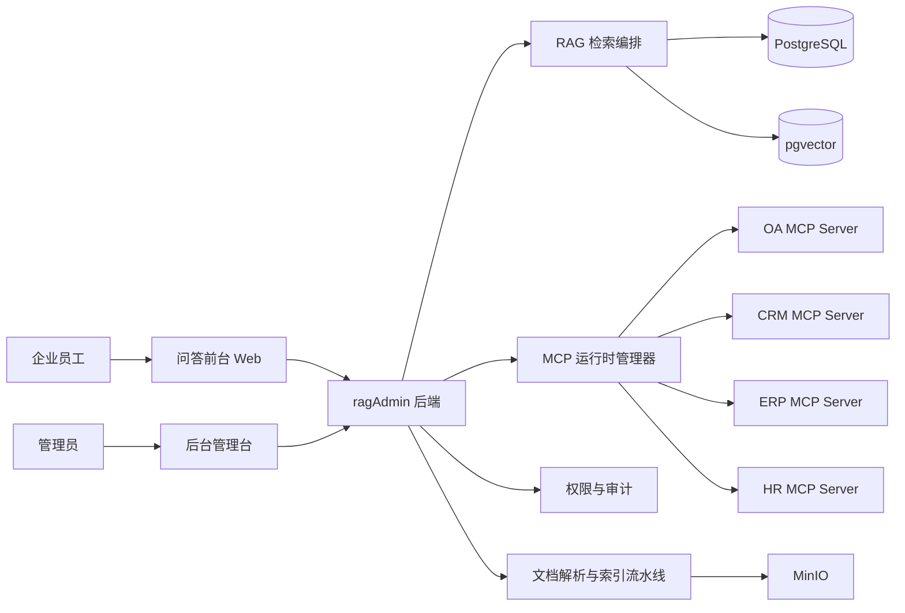

# MCP 内部工具平台设计

## 目录

- [1. 背景与目标](#1-背景与目标)
- [2. 核心结论](#2-核心结论)
- [3. 适用范围与边界](#3-适用范围与边界)
- [4. 总体架构](#4-总体架构)
- [5. 业务系统接入规范](#5-业务系统接入规范)
- [6. 平台模块设计](#6-平台模块设计)
- [7. 数据模型建议](#7-数据模型建议)
- [8. 后台管理模块设计](#8-后台管理模块设计)
- [9. 运行时装配设计](#9-运行时装配设计)
- [10. 问答链路集成策略](#10-问答链路集成策略)
- [11. 安全与治理要求](#11-安全与治理要求)
- [12. OCR 与 stdio 判断](#12-ocr-与-stdio-判断)
- [13. 一期实现范围](#13-一期实现范围)
- [14. 后续演进建议](#14-后续演进建议)

## 1. 背景与目标

`ragAdmin` 的定位是企业组织内部使用的 RAG 知识库系统，服务对象是企业员工，访问范围以企业内网为主，目标是将知识库问答能力与企业内部业务系统能力结合起来，形成“知识检索 + 业务查询”的统一智能入口。

本设计文档关注的不是通用型 Agent 平台，而是适合企业内部知识系统的 `MCP` 工具接入方案。核心目标如下：

- 后台管理员可以可视化维护内部 `MCP Server`
- 问答系统可以按知识库、场景和权限动态调用内部工具
- 不再依赖 `application.yml` 静态逐条维护 `MCP Server`
- 不接入外网 `MCP`
- 不把系统做成类似 `Claude Code` 的通用开发者 Agent 容器

## 2. 核心结论

### 2.1 传输协议结论

- 一期统一采用 `Streamable-HTTP`
- 不采用 `SSE`
- 不把 `stdio` 作为主接入方式

### 2.2 配置管理结论

- 不以 `mcp-server.json` 作为平台内部唯一配置模型
- 后台管理系统维护结构化配置
- 如后续需要兼容桌面端生态，可额外提供 `stdio` 风格 JSON 的导入导出能力，但不作为内部事实来源

### 2.3 业务定位结论

- `RAG` 是主链路
- `MCP` 是内部业务工具增强链路
- `MCP` 只接企业内部业务系统
- 不接外网通用工具，例如公开搜索、网页抓取、开发者文档工具等

### 2.4 网络协议结论

- 对于企业自有内网部署，一期允许内部 `MCP Server` 使用 `HTTP`
- 但平台数据模型与运行时实现应预留 `HTTPS` 升级能力，避免后续重构
- 面向员工浏览器访问的问答 Web 系统，仍建议优先支持 `HTTPS`

## 3. 适用范围与边界

本方案适用以下类型的内部系统能力：

- OA 审批状态查询
- CRM 客户资料查询
- ERP 订单、库存、采购状态查询
- 工单系统单据查询
- HR 组织、假期、制度查询
- BI 指标查询
- 内部门户、文档中心、知识中心查询

本方案暂不覆盖以下能力：

- 外网公开工具接入
- 本机文件系统、Shell、Git 等开发者工具型 `MCP`
- 高风险写操作，例如直接创建单据、审批通过、批量修改主数据
- 将整个问答系统改造成“通用 Agent 执行平台”

## 4. 总体架构

### 4.1 设计思想

- `ragAdmin` 只做 `MCP Client`
- 企业内部各业务系统对外暴露 `Streamable-HTTP MCP Server`
- 业务系统使用何种语言实现不重要，只要求遵守 `MCP Streamable-HTTP` 协议
- `ragAdmin` 内部统一完成服务发现、工具探活、权限绑定、审计留痕和运行时调度

### 4.2 关键边界

- 问答系统不直接依赖某个业务系统的 SDK
- `MCP` 只位于工具适配层和编排层，不下沉到核心知识库领域模型
- 不允许把工具调用逻辑散落到 Controller
- 所有工具调用必须有显式审计

## 5. 业务系统接入规范

### 5.1 接入原则

企业内部业务系统需要自行改造为 `MCP Server`，并满足以下约束：

- 对外暴露 `Streamable-HTTP` 接口
- 提供可用的工具列表
- 为每个工具提供清晰描述和输入参数结构
- 工具能力优先面向“查询”而不是“修改”
- 对调用方做服务鉴权
- 具备基础超时、熔断和日志能力

### 5.2 语言技术栈约束

不限制业务系统语言与框架，例如：

- `Node.js`
- `Java`
- `C#`
- `Go`
- `Python`

只要业务系统遵守 `Streamable-HTTP MCP` 协议即可接入，`ragAdmin` 不关心其内部实现细节。

### 5.3 推荐工具设计风格

推荐把业务能力设计成“高语义、强约束、低风险”的工具，而不是简单暴露底层表查询。

推荐示例：

- `query_oa_approval_status`
- `query_crm_customer_profile`
- `query_erp_order_status`
- `query_hr_leave_balance`

不推荐示例：

- `execute_sql`
- `run_any_query`
- `call_raw_api`

## 6. 平台模块设计

### 6.1 模块划分

建议新增以下模块能力：

1. `MCP Server Registry`
   负责维护内部 `MCP Server` 的基础配置。

2. `MCP Tool Catalog`
   负责缓存工具清单、参数摘要和状态。

3. `MCP Binding`
   负责知识库、问答场景、用户角色与工具之间的绑定关系。

4. `MCP Runtime Manager`
   负责运行时创建、刷新、失效、关闭客户端连接。

5. `MCP Audit`
   负责工具调用审计、失败记录、耗时追踪和治理统计。

### 6.2 与现有系统关系

- `Model Gateway` 负责模型
- `Knowledge Pipeline` 负责文档导入、解析、向量化
- `Retrieval Orchestrator` 负责检索增强问答
- `MCP Runtime Manager` 负责内部工具接入

`MCP` 不替代 `RAG`，而是作为 `Retrieval Orchestrator` 的补充能力。

## 7. 数据模型建议

### 7.1 `mcp_server`

用于维护 `MCP Server` 基础配置。

建议字段：

- `id`
- `server_code`
- `server_name`
- `transport_type`
- `base_url`
- `endpoint_path`
- `auth_type`
- `auth_config_json`
- `timeout_ms`
- `connect_timeout_ms`
- `read_timeout_ms`
- `status`
- `health_status`
- `last_health_check_at`
- `last_health_error`
- `remark`
- `created_by`
- `updated_by`
- `created_at`
- `updated_at`

约束建议：

- `transport_type` 一期固定为 `STREAMABLE_HTTP`
- `status` 使用 `ENABLED` / `DISABLED`
- `health_status` 使用 `UNKNOWN` / `UP` / `DOWN`

### 7.2 `mcp_tool_snapshot`

用于缓存探活后发现的工具快照，便于后台展示和绑定。

建议字段：

- `id`
- `server_id`
- `tool_name`
- `tool_title`
- `tool_description`
- `input_schema_json`
- `risk_level`
- `enabled`
- `last_discovered_at`
- `created_at`
- `updated_at`

### 7.3 `knowledge_base_mcp_server_rel`

用于维护知识库和 `MCP Server` 的绑定关系。

建议字段：

- `id`
- `kb_id`
- `server_id`
- `enabled`
- `sort_no`
- `created_at`
- `updated_at`

### 7.4 `knowledge_base_mcp_tool_rel`

用于更细粒度地控制某个知识库允许调用哪些工具。

建议字段：

- `id`
- `kb_id`
- `tool_snapshot_id`
- `enabled`
- `sort_no`
- `created_at`
- `updated_at`

### 7.5 `mcp_call_audit`

用于记录每次工具调用情况。

建议字段：

- `id`
- `session_id`
- `message_id`
- `user_id`
- `kb_id`
- `server_id`
- `tool_name`
- `request_summary`
- `response_summary`
- `call_status`
- `latency_ms`
- `error_message`
- `created_at`

### 7.6 设计说明

采用“服务配置表 + 工具快照表 + 绑定表 + 审计表”的模型，原因如下：

- 服务配置与工具清单的变化频率不同
- 工具发现结果需要缓存，不能每次打开页面都实时拉取
- 知识库级绑定比全局开关更适合内部系统治理
- 审计与配置必须解耦

## 8. 后台管理模块设计

### 8.1 模块入口

建议在后台治理模块中新增“内部工具平台”次级入口，避免影响知识库主操作流。

### 8.2 页面结构建议

#### 8.2.1 `MCP Server` 列表页

支持：

- 列表
- 条件筛选
- 新增
- 编辑
- 启停
- 删除
- 探活
- 查看工具数
- 查看最近健康状态

筛选项建议：

- 服务名称
- 服务编码
- 状态
- 健康状态

#### 8.2.2 `MCP Server` 编辑页

配置项建议：

- 服务名称
- 服务编码
- 传输协议
- `Base URL`
- `Endpoint Path`
- 认证方式
- 认证配置
- 超时
- 备注

#### 8.2.3 工具清单页

支持：

- 查看某个 `Server` 下已发现工具
- 手动刷新工具列表
- 启停工具
- 查看参数结构摘要
- 标记风险等级

#### 8.2.4 知识库绑定页

支持：

- 为某个知识库选择可用 `MCP Server`
- 为某个知识库勾选允许调用的工具
- 查看工具启用范围和顺序

## 9. 运行时装配设计

### 9.1 设计原则

- 不依赖 `application.yml` 静态配置所有 `MCP Server`
- 后台配置变更后，运行时可刷新
- 运行时状态和数据库配置分离

### 9.2 核心组件建议

建议新增 `McpClientRuntimeManager`，负责：

- 加载启用中的 `MCP Server`
- 为每个服务创建运行时客户端
- 缓存运行时对象
- 配置变更后失效旧实例
- 探活
- 拉取工具清单
- 统一关闭资源

### 9.3 生命周期

启动阶段：

1. 加载所有启用中的 `MCP Server`
2. 初始化运行时客户端
3. 拉取工具列表并刷新 `mcp_tool_snapshot`

变更阶段：

1. 管理员修改配置
2. 持久化数据库
3. 通知 `McpClientRuntimeManager`
4. 销毁旧实例
5. 创建新实例
6. 重新探活并刷新工具清单

### 9.4 为什么不使用 `mcp-server.json`

原因如下：

- 你的平台只做 `Streamable-HTTP`
- `mcp-server.json` 更接近桌面端 `stdio` 配置风格
- 平台需要的是结构化配置、健康状态、绑定关系、审计字段
- 原始 JSON 文本不利于后台可视化治理

因此，`mcp-server.json` 不应作为后台内部配置事实来源。

## 10. 问答链路集成策略

### 10.1 总体原则

问答默认先走 `RAG`，只有在满足条件时才调用 `MCP` 工具。

### 10.2 推荐调用顺序

1. 用户提问
2. 判断当前知识库和场景是否绑定了内部工具
3. 执行知识库检索
4. 由编排层判断是否需要补充工具调用
5. 如需要，则调用绑定的 `MCP` 工具
6. 将知识片段和工具结果共同交给模型生成答案
7. 记录引用与工具调用审计

### 10.3 一期调用策略建议

一期建议采用保守策略：

- 只允许显式绑定的工具参与问答
- 只允许查询型工具
- 每轮最多调用有限个工具
- 工具调用失败时优先降级，不阻断主问答链路

### 10.4 不建议的做法

- 所有问题都默认先调工具
- 未绑定知识库也可任意调所有内部系统
- 模型自行发现所有服务并自由调用

## 11. 安全与治理要求

### 11.1 网络边界

- 一期允许内网 `HTTP`
- 但仍需限制为企业内网地址，禁止任意公网地址
- 应设置地址白名单、网段白名单或服务注册白名单

### 11.2 认证建议

即使是内网，也不建议完全匿名调用。

建议至少支持：

- 固定 Token
- 服务间签名
- 网关转发统一身份

### 11.3 权限建议

必须支持以下限制：

- 哪些知识库可调用哪些 `MCP Server`
- 哪些知识库可调用哪些工具
- 哪些用户角色可使用工具增强问答

### 11.4 审计建议

必须记录：

- 谁调用了什么工具
- 在哪个知识库、哪个会话、哪条消息下触发
- 调用了几次
- 是否成功
- 输入输出摘要
- 耗时

## 12. OCR 与 stdio 判断

### 12.1 结论

对于 `ragAdmin` 中 PDF / IMAGE 的 OCR 识别，默认不建议走 `MCP`，更不建议为了 OCR 专门引入 `stdio`。

推荐顺序如下：

1. 优先作为知识库文档解析流水线内部能力实现
2. 如果 OCR 是独立内部服务，则优先做成普通内部 `HTTP` / `RPC` 服务
3. 只有在存在现成的本地 CLI 工具且短期无法服务化时，才考虑用 `stdio` 作为过渡方案

### 12.2 为什么 OCR 不必走 MCP

原因如下：

- OCR 属于文档处理流水线能力，不是问答时临时调用的业务工具
- OCR 更适合归入 `Knowledge Pipeline`
- OCR 调用通常是长耗时阻塞型任务，天然属于异步解析任务链路
- OCR 的输入输出、重试、并发、落盘、任务状态管理，与 `MCP` 工具型调用模型并不相同

### 12.3 什么时候才需要 `stdio`

仅在以下场景下可考虑：

- 企业已大量使用本地 OCR 二进制程序，例如 `tesseract`、本地图像处理脚本、PDF 转换命令
- 短期内无法把 OCR 能力服务化
- 希望以最小改动把一个现成本机程序包装成可调用能力

即使如此，也更推荐把它包装成平台内部解析适配层，而不是纳入企业内部业务 `MCP Server` 主体系。

### 12.4 本项目建议

本项目的一期建议是：

- `MCP` 体系只负责企业内部业务系统工具接入
- OCR 仍然归属于文档解析链路
- 不引入 `stdio`
- 默认由系统在文档上传后自动完成 OCR 与后续入库，不把人工先跑 `MinerU` 等工具作为标准前置流程
- 当前若采用 `Tesseract` CLI 适配，本地开发可使用 Windows 路径，生产部署到 Linux 时必须切换为 Linux 命令或内部 OCR 服务
- 如果后续需要更强的复杂版式解析能力，可把 `MinerU` 等能力作为解析链路增强节点接入，但仍保持在 `Knowledge Pipeline` 内部

## 13. 一期实现范围

一期建议只做以下范围：

- 支持内部 `Streamable-HTTP MCP Server` 配置管理
- 支持探活与工具清单发现
- 支持知识库级别的 `Server` / 工具绑定
- 支持问答链路按知识库调用内部查询型工具
- 支持工具调用审计

一期不做：

- 外网 `MCP`
- `stdio`
- `SSE`
- 高风险写操作工具
- `mcp-server.json` 兼容层

## 14. 后续演进建议

### 14.1 二期可考虑

- 支持 `HTTPS`
- 支持更细粒度的角色权限控制
- 支持工具调用限流、熔断和重试策略
- 支持知识库之外的“问答助手模板”级绑定
- 支持工具调用统计报表

### 14.2 三期可考虑

- 在确有必要时，再评估少量 `stdio` 过渡能力
- 提供 `mcp-server.json` 导入导出，仅作为兼容桌面生态的辅助能力

## 15. 最终建议

对于 `ragAdmin`，最合理的工程路径是：

- 将企业内部业务系统统一改造成 `Streamable-HTTP MCP Server`
- `ragAdmin` 后台维护结构化配置，而不是维护原始 JSON 文本
- 问答系统坚持 `RAG 为主、MCP 为辅`
- 内部网络一期允许 `HTTP`
- OCR 不进入 `MCP` 主体系，不引入 `stdio`

这样可以保证系统边界清晰、治理能力完整，并且与企业内部知识平台定位一致。
